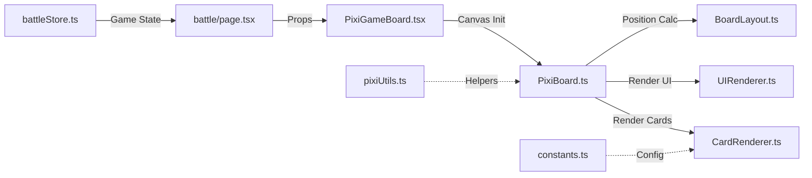
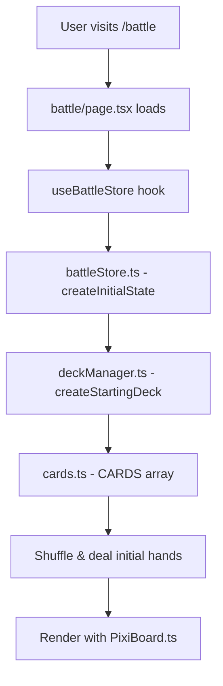
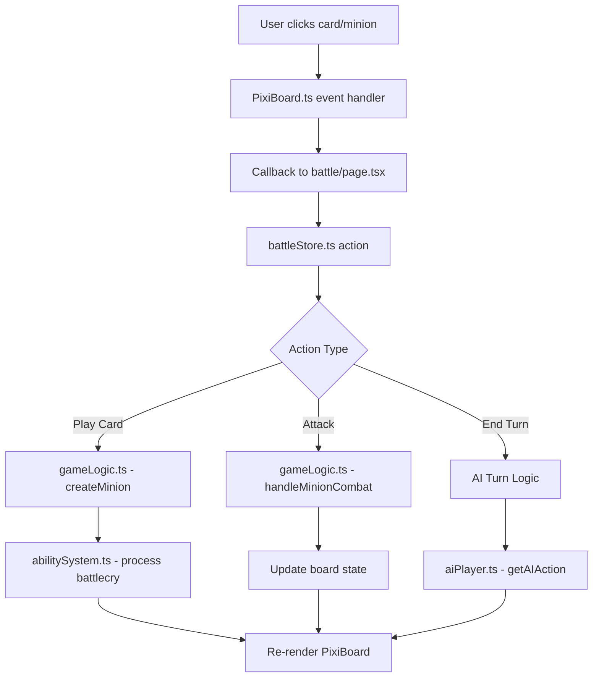
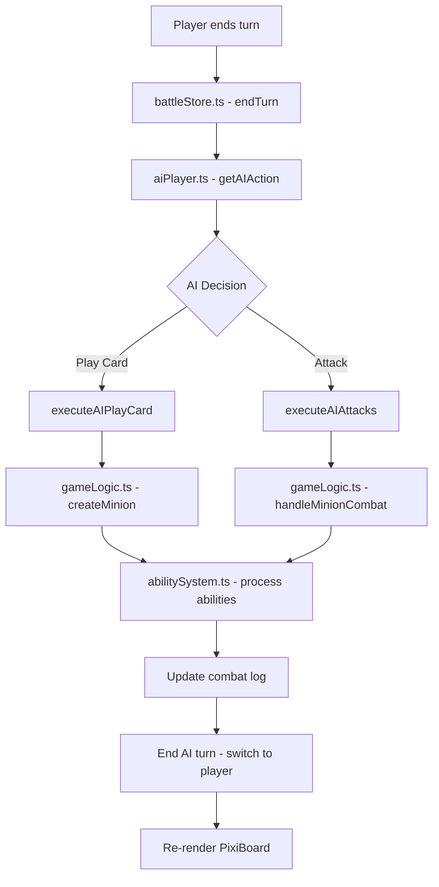

## Five Realms (Cúige na hÉireann)

Five Realms is a Hearthstone-inspired card game featuring figures and creatures from Irish folklore. Players battle using cards representing the five ancient provinces of Ireland, each with unique elemental aspects and abilities.

## Quick Start

```bash
# Install dependencies
npm install

# Run development server
npm run dev

# Build for production
npm run build

# Start production server
npm start
```

Open [http://localhost:3000](http://localhost:3000) to play

## Project Structure

```
fiverealms/
├── app/                        # Next.js App Router
│   ├── layout.tsx             # Root layout with fonts & metadata
│   ├── page.tsx               # Home page with navigation
│   └── battle/
│       └── page.tsx           # Main battle UI (React wrapper)
│
├── components/game/            # React UI Components
│   ├── PixiGameBoard.tsx      # PixiJS canvas wrapper
│   ├── BattleCanvas.tsx       # Legacy Framer Motion UI (deprecated)
│   └── Card.tsx               # Individual card component
│
├── lib/
│   ├── pixi/                  # PixiJS Rendering Engine (NEW)
│   │   ├── PixiBoard.ts       # Main board orchestrator
│   │   ├── CardRenderer.ts    # Card visual creation
│   │   ├── BoardLayout.ts     # Hearthstone-style positioning
│   │   └── UIRenderer.ts      # UI elements (portraits, buttons, etc.)
│   │
│   ├── game/                  # Pure Game Logic (No UI)
│   │   ├── gameLogic.ts       # Core combat & minion logic
│   │   ├── deckManager.ts     # Deck building & card drawing
│   │   ├── abilitySystem.ts   # Card ability processing
│   │   └── aiPlayer.ts        # AI decision-making
│   │
│   ├── store/
│   │   └── battleStore.ts     # Zustand state management
│   │
│   ├── data/
│   │   └── cards.ts           # Card database (28+ cards)
│   │
│   ├── types/
│   │   └── game.ts            # TypeScript interfaces
│   │
│   └── utils/                 # Helper Functions
│       ├── cardHelpers.ts     # Card utilities
│       ├── constants.ts       # Game constants
│       ├── pixiUtils.ts       # PixiJS helpers
│       └── clientUtils.ts     # Client-side only utilities
│
└── public/images/             # Game Assets
    ├── cards/                 # Card artwork (PNG)
    └── default/               # Placeholder images
```

## Architecture Overview

```
┌─────────────────────────────────────────────────────────────┐
│                    React UI Layer                           │
│  (battle/page.tsx → PixiGameBoard.tsx → PixiBoard.ts)      │
└────────────────────┬────────────────────────────────────────┘
                     │
                     ↓
┌─────────────────────────────────────────────────────────────┐
│              State Management Layer                         │
│              (battleStore.ts - Zustand)                     │
└────────────────────┬────────────────────────────────────────┘
                     │
                     ↓
┌─────────────────────────────────────────────────────────────┐
│              Pure Game Logic Layer                          │
│  (gameLogic.ts, deckManager.ts, abilitySystem.ts, etc.)    │
└────────────────────┬────────────────────────────────────────┘
                     │
                     ↓
┌─────────────────────────────────────────────────────────────┐
│              Data & Types Layer                             │
│              (cards.ts, game.ts)                            │
└─────────────────────────────────────────────────────────────┘
```

## Rendering Pipeline (PixiJS)

**New Hearthstone-Style Visual System**



## Updated Data Flow Diagrams

### **1. Game Initialization Flow**



### **2. Player Action Flow**



### **3. AI Turn Flow**



---

## Current Technology Stack

| Category | Technology | Version | Purpose |
|----------|-----------|---------|---------|
| **Framework** | Next.js | 15.5.4 | React framework with App Router |
| **UI Library** | React | 19.1.0 | Component-based UI |
| **Language** | TypeScript | 5.x | Type safety |
| **Rendering** | PixiJS | 8.6.6 | WebGL canvas rendering |
| **State** | Zustand | 5.0.8 | Lightweight state management |
| **Styling** | Tailwind CSS | 4.x | Inlining CSS styles for ease of use |
| **Animation** | Framer Motion | 12.x | UI transitions (legacy, to be removed) |
| **Linting** | ESLint | 9.x | Code quality |

---
