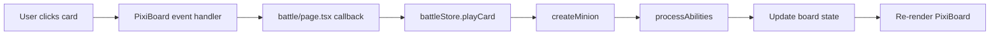
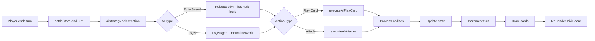
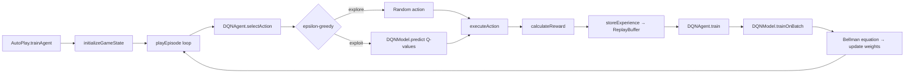

## Five Realms (Cúige na hÉireann)

Five Realms is a Hearthstone-inspired card game featuring figures and creatures from Irish folklore. Players battle using cards representing the five ancient provinces of Ireland, each with unique elemental aspects and abilities.

## Quick Start

```bash
# Install dependencies
npm install

# Run development server
npm run dev
```

## File Documentation
All files I've personally added to the project (not ones installed by the framework/libraries) will have their own documentation commented in headers at the top of 
the corresponding file. I am currently updating and adding to these where necessary.

## Project Structure

```
fiverealms/
├── app/                          # Next.js App Router
│   ├── layout.tsx               # Root layout with fonts & metadata
│   ├── page.tsx                 # Home page with navigation
│   └── battle/
│       └── page.tsx             # Battle page (React wrapper)
│
├── components/
│   ├── game/
│   │   └── PixiGameBoard.tsx    # PixiJS canvas wrapper component
│   ├── AISelector.tsx           # AI type selection UI (Rule-Based vs DQN)
│   └── DeckSelector.tsx         # Deck selection UI
│
├── lib/
│   ├── ai/                      # AI System
│   │   ├── aiStrategy.ts        # Strategy interface + RuleBasedAI + DQNAgent stub
│   │   └── dqn/                 # Deep Q-Network Implementation
│   │       ├── ActionSpace.ts       # Action encoding/decoding (68 actions)
│   │       ├── AutoPlay.ts          # Self-play training loop
│   │       ├── DQNAgent.ts          # Agent brain (epsilon-greedy, replay)
│   │       ├── DQNModel.ts          # TensorFlow.js neural network
│   │       ├── ExperienceReplay.ts  # Replay buffer (circular, 50k capacity)
│   │       ├── RewardSystem.ts      # Reward shaping & configs
│   │       └── stateEncoder.ts      # Game state → 121-feature vector
│   │
│   ├── pixi/                    # PixiJS Rendering Engine
│   │   ├── PixiBoard.ts         # Main board orchestrator
│   │   ├── index.ts             # Public exports
│   │   ├── layout/
│   │   │   └── BoardLayout.ts   # Hearthstone-style positioning
│   │   ├── rendering/
│   │   │   ├── CardRenderer.ts      # Card visual creation
│   │   │   ├── HandRenderer.ts      # Hand rendering
│   │   │   ├── MinionRenderer.ts    # Board minion rendering
│   │   │   └── BoardRenderer.ts     # Background rendering
│   │   ├── ui/
│   │   │   ├── UIManager.ts         # UI orchestration
│   │   │   ├── HoverCardDisplay.ts  # Card hover tooltip (detailed view)
│   │   │   ├── PortraitRenderer.ts  # Hero portraits
│   │   │   ├── CombatLogRenderer.ts # Combat log
│   │   │   ├── EndTurnButton.ts     # Turn button
│   │   │   ├── DeckIndicator.ts     # Deck counters
│   │   │   └── TurnIndicator.ts     # Turn display
│   │   └── utils/
│   │       ├── TextureLoader.ts     # Asset loading
│   │       ├── GraphicsHelpers.ts   # Reusable graphics components
│   │       └── StyleConstants.ts    # Visual constants & colors
│   │
│   ├── game/                    # Pure Game Logic
│   │   ├── gameLogic.ts         # Core combat & minion logic
│   │   ├── deckManager.ts       # Deck building & card drawing
│   │   ├── abilitySystem.ts     # Card ability processing
│   │   └── aiPlayer.ts          # Rule-based AI decision-making
│   │
│   ├── store/
│   │   ├── battleStore.ts       # Main Zustand store
│   │   └── slices/              # Modular state slices
│   │       ├── battleSlice.ts        # Core battle state
│   │       ├── deckSlice.ts          # Deck + AI type selection
│   │       ├── gameActionsSlice.ts   # Play/attack actions
│   │       ├── turnSlice.ts          # Turn management & AI (strategy pattern)
│   │       └── initializationSlice.ts # Game initialization
│   │
│   ├── data/
│   │   └── cards.ts             # Temporary card database
│   │
│   ├── types/
│   │   └── game.ts              # TypeScript interfaces
│   │
│   └── utils/
│       ├── cardHelpers.ts       # Card utility functions
│       └── constants.ts         # Game constants & styling
│
└── public/images/               # Game Assets
    ├── cards/                   # Card artwork (PNG)
    └── default/                 # Placeholder images
```

## Architecture Overview

```
┌─────────────────────────────────────────────────────────────┐
│                    React UI Layer                           │
│  (battle/page.tsx → PixiGameBoard.tsx → PixiBoard.ts)       │
└────────────────────┬────────────────────────────────────────┘
                     │
                     ↓
┌─────────────────────────────────────────────────────────────┐
│              State Management Layer                         │
│       (battleStore.ts - Zustand with Slices)                │
└────────────────────┬────────────────────────────────────────┘
                     │
                     ↓
┌─────────────────────────────────────────────────────────────┐
│              Pure Game Logic Layer                          │
│  (gameLogic.ts, deckManager.ts, abilitySystem.ts, etc.)     │
└────────────────────┬────────────────────────────────────────┘
                     │
                     ↓
┌─────────────────────────────────────────────────────────────┐
│                   AI Layer                                  │
│  (aiStrategy.ts → RuleBasedAI | DQNAgent → dqn/)           │
└────────────────────┬────────────────────────────────────────┘
                     │
                     ↓
┌─────────────────────────────────────────────────────────────┐
│              Data & Types Layer                             │
│              (cards.ts, game.ts)                            │
└─────────────────────────────────────────────────────────────┘
```

## Example Data Flow Diagrams

### **1. Game Initialization Flow**

```mermaid
graph LR
    A[User visits /battle] --> B[battle/page.tsx]
    B --> C[useBattleStore]
    C --> D[createInitializationSlice]
    D --> E[startBattle]
    E --> F[createArchetypeDeck]
    F --> G[shuffleDeck]
    G --> H[drawCards]
    H --> I[Initialize player & AI state]
    I --> J[Render with PixiBoard]
```



### **2. Player Action Flow**



### **3. AI Turn Flow**



### **4. DQN Training Flow**



---

## AI System

The AI system uses the **Strategy Pattern** so opponent types can be swapped without changing game logic. Both implement the `AIStrategy` interface, making them interchangeable.

### Rule-Based AI (`aiStrategy.ts` → `aiPlayer.ts`)
A simple heuristic opponent that plays on curve, makes favorable board trades, and prioritises lethal damage. No training required.

### DQN Agent (`lib/ai/dqn/`)
A Deep Q-Network implementation using TensorFlow.js. Currently falls back to rule-based logic until a trained model is loaded.

| Component | File | Purpose |
|-----------|------|---------|
| Agent brain | `DQNAgent.ts` | Epsilon-greedy action selection, training loop |
| Neural network | `DQNModel.ts` | 121→128→128→64→68 feed-forward network |
| Memory | `ExperienceReplay.ts` | Circular replay buffer (50k capacity) |
| Actions | `ActionSpace.ts` | Encodes/decodes 68 possible game actions |
| Rewards | `RewardSystem.ts` | Configurable reward shaping (aggressive/defensive/tempo) |
| State | `stateEncoder.ts` | Converts game state to 121-feature vector |
| Training | `AutoPlay.ts` | Self-play loop, universal training across all matchups |

**Action Space (68 total):**
- `0–9`: Play card from hand
- `10–59`: Attack with board minion (7 attackers × 7 targets)
- `60–66`: Attack enemy hero (7 attackers)
- `67`: End turn

**State Vector (121 features):** Player/opponent vitals (9), hand cards × 4 features (40), player board × 5 features (35), opponent board × 5 features (35), deck sizes (2), normalised to `[0, 1]`.

---

## Current Technology Stack

| Category          | Technology | Purpose |
|-------------------|------------|-------------------------------------|
| **Framework**     | Next.js    | React framework with App Router     |
| **UI Library**    | React      | Component-based UI                  |
| **Language**      | TypeScript | Type safety                         |
| **Rendering**     | PixiJS     | WebGL canvas rendering              |
| **State**         | Zustand    | Lightweight state management        |
| **Styling**       | Tailwind   | Inlining CSS styles for ease of use |
| **ML**            | TensorFlow.js | DQN neural network (browser-side) |

---

## Immediate Todo
- [ ] Refactor multiple files and remove unused/legacy code and functions
- [ ] Extract more shared helpers into `GraphicsHelpers.ts` (noted in `MinionRenderer.ts`)
- [ ] Consolidate card-on-board design with hand card design for better visual cohesion (`MinionRenderer.ts` TODO)

## Medium-term Todo
- [ ] Implement sprite pooling to better improve PixiJS performance
- [ ] Train the DQN agent and persist a model to replace the rule-based fallback
- [ ] Build a `TrainingPanel` UI component for in-browser training visualisation

## Long-term Todo
- [ ] Set up database for cards, accounts + logins for multiple players
- [ ] Add WebSocket support for multiplayer
- [ ] Implement deck builder UI, glossary for all cards and lore information