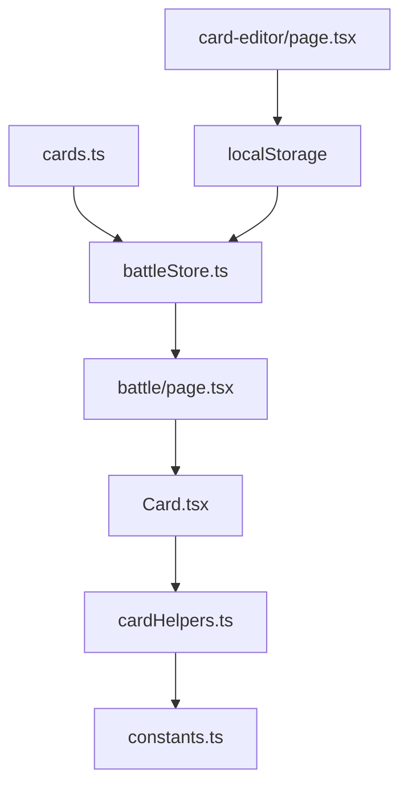

## Five Realms (Cúige na hÉireann)

A digital card battle game inspired by Irish mythology, built with Next.js and TypeScript.

## Game Overview

Five Realms is a Hearthstone-inspired card game featuring legendary figures and creatures from Irish folklore. Players battle using cards representing the five ancient provinces of Ireland, each with unique elemental affinities and mystical abilities.

## Quick Start

```bash
# Install dependencies
npm install

# Run development server
npm run dev

# Build for production
npm run build

# Start production server
npm start
```

Open [http://localhost:3000](http://localhost:3000) to play

## Project Structure

```
packquest/
├── app/                          # Next.js App Router
│   ├── battle/                   # Battle game page
│   ├── card-editor/              # Card creation interface
│   ├── layout.tsx                # Root layout with fonts
│   ├── page.tsx                  # Home page with navigation
│   └── globals.css               # Global styles & Tailwind
├── components/
│   └── game/
│       ├── Card.tsx              # Interactive card component
│       └── BattleCanvas.tsx      # Game board (future PIXI.js)
├── lib/
│   ├── data/
│   │   └── cards.ts              # Card database (static)
│   ├── store/
│   │   └── battleStore.ts        # Zustand game state
│   ├── types/
│   │   └── game.ts               # TypeScript interfaces
│   └── utils/
│       ├── cardHelpers.ts        # Card utility functions
│       ├── constants.ts          # Game constants & styling
│       └── gameLogic.ts          # Core game mechanics
├── public/
│   └── images/cards/             # Card artwork assets
└── package.json                  # Dependencies & scripts
```

## File Interactions

### Core Game Flow
```
page.tsx → battle/page.tsx → battleStore.ts → game.ts
    ↓            ↓              ↓              ↓
navigation → game board → state management → type safety
```

### Card System
```
cards.ts → Card.tsx → cardHelpers.ts → constants.ts
    ↓         ↓           ↓              ↓
card data → rendering → utilities → styling
```

### UI Architecture
```
layout.tsx → globals.css → constants.ts → Card.tsx
    ↓           ↓             ↓            ↓
fonts → base styles → theme colors → components
```

## Key Files Explained

### **App Router (`app/`)**
- **`layout.tsx`**: Root layout with Geist fonts and metadata
- **`page.tsx`**: Landing page with game navigation
- **`battle/page.tsx`**: Main game interface with Celtic theming
- **`card-editor/page.tsx`**: Visual card creation tool
- **`globals.css`**: Tailwind imports and CSS variables

### **Game Logic (`lib/`)**
- **`store/battleStore.ts`**: Zustand state management for turns, attacks, card playing
- **`types/game.ts`**: TypeScript definitions for cards, players, abilities
- **`data/cards.ts`**: Static card database with Irish mythology creatures
- **`utils/gameLogic.ts`**: Core mechanics (damage, mana, win conditions)
- **`utils/cardHelpers.ts`**: Card utilities (ID generation, validation, filtering)
- **`utils/constants.ts`**: Game constants, styling themes, keyword definitions

### **Components (`components/`)**
- **`game/Card.tsx`**: Interactive card with hover details and Celtic styling
- **`game/BattleCanvas.tsx`**: Placeholder for future PIXI.js game board

## Current Technology Stack

### **Frontend Framework**
- **Next.js 15.5.4** - React framework with App Router
- **React 19.1.0** - UI library with latest features
- **TypeScript 5** - Type safety and developer experience

### **Styling & Animation**
- **Tailwind CSS 4** - Utility-first CSS framework
- **Framer Motion 12** - Animation library (current)
- **Custom CSS** - Celtic-themed gradients and effects

### **State Management**
- **Zustand 5.0.8** - Lightweight state management
- **React Hooks** - Local component state

### **Development Tools**
- **ESLint 9** - Code linting and formatting
- **PostCSS** - CSS processing
- **Turbopack** - Fast bundling (Next.js built-in)

## Future Technology Roadmap

### **Graphics & Performance** (Next Major Update)
- **PIXI.js 8.13.2** → Replace Framer Motion for game board
  - Hardware-accelerated rendering
  - Smooth card animations and particle effects
  - Interactive battlefield with Celtic mysticism

### **Backend & Data** (Phase 2)
- **Database Integration** - Replace static card files
  - PostgreSQL for card storage
  - User accounts and collection management
  - Match history and statistics

### **Multiplayer** (Phase 3)
- **Real-time Multiplayer**
  - Socket.io or WebRTC for live matches
  - Matchmaking system
  - Spectator mode

### **Enhanced Features** (Phase 4)
- **Advanced AI** - Machine learning opponents

## Game Mechanics

### **Elements System**
- **🔥 Fire** - Aggressive damage dealers
- **💧 Water** - Card draw and wisdom
- **🌿 Earth** - Healing and protection  
- **💨 Air** - Versatility and discovery
- **👻 Spirit** - Death and resurrection
- **⚪ Neutral** - Universal effects

### **Card Types**
- **Minions** - Creatures with Attack/Health that fight
- **Spells** - One-time magical effects

### **Abilities**
- **Battlecry** - Triggers when played
- **Deathrattle** - Triggers when destroyed
- **Passive** - Always active effects

## Data Flow



## Design Philosophy

### **Irish Mythology Theme**
- Emerald greens and Celtic golds
- Ancient stone textures and mystical effects
- Authentic Irish names and folklore references

### **Responsive Design**
- Mobile-first card interactions
- Scalable UI for different screen sizes
- Accessible color schemes and typography

### **Performance Focus**
- Optimized animations and transitions
- Efficient state management
- Lazy loading for card images

## Development Notes

### **Current Priorities**
1. Core gameplay mechanics
2. Card creation interface  
3. Celtic visual theming
4. Enhanced animations
5. PIXI.js integration

## Project Flow Explained

### **Entry Point Flow**
*When a user visits the app:*

1. **`layout.tsx`** sets up the root HTML structure with Geist fonts and metadata
2. **`page.tsx`** renders the home page with navigation buttons
3. User clicks "Start Battle" → routes to **`app/battle/page.tsx`**
4. User clicks "Card Editor" → routes to **`app/card-editor/page.tsx`**

### **Battle Game Flow**
*When playing the game:*

1. **`app/battle/page.tsx`** imports `useBattleStore` from **`lib/store/battleStore.ts`**
2. **`battleStore.ts`** imports card data from **`lib/data/cards.ts`** and types from **`lib/types/game.ts`**
3. **`battleStore.ts`** manages all game state (player health, cards, turns) using Zustand
4. **`battle/page.tsx`** renders the game board and imports **`components/game/Card.tsx`** for each card
5. **`Card.tsx`** imports utilities from **`lib/utils/cardHelpers.ts`** and styling from **`lib/utils/constants.ts`**

### **Card Rendering Flow**
*When a card appears on screen:*

1. **`Card.tsx`** receives card data as props from the battle page
2. It calls `getCardClassNames()` from **`cardHelpers.ts`** to determine styling
3. **`cardHelpers.ts`** imports color constants from **`constants.ts`**
4. **`Card.tsx`** uses Framer Motion for animations and hover effects
5. Card hover triggers **`CardDetail`** component portal rendering

### **State Management Flow**
*When game actions happen:*

1. User clicks a card → **`Card.tsx`** calls `onClick` prop
2. **`battle/page.tsx`** calls `playCard()` from **`battleStore.ts`**
3. **`battleStore.ts`** updates Zustand state using game logic
4. State change triggers re-render of **`battle/page.tsx`**
5. Updated props flow down to **`Card.tsx`** components

### **Card Editor Flow**
*When creating new cards:*

1. **`card-editor/page.tsx`** provides form inputs for card creation
2. Form uses same types from **`lib/types/game.ts`** for validation
3. Created cards saved to browser localStorage
4. **`battleStore.ts`** can import these cards alongside static ones from **`cards.ts`**

### **Styling Flow**
*How the Celtic theme works:*

1. **`app/globals.css`** imports Tailwind and sets CSS variables
2. **`lib/utils/constants.ts`** defines Celtic color schemes and element styles
3. **`cardHelpers.ts`** combines these constants into Tailwind classes
4. **`Card.tsx`** and **`battle/page.tsx`** apply these classes for consistent theming

### **Type Safety Flow**
*How TypeScript keeps everything connected:*

1. **`lib/types/game.ts`** defines all interfaces (`Card`, `Minion`, `BattleState`, etc.)
2. **`cards.ts`** exports typed card data
3. **`battleStore.ts`** uses these types for state management
4. **`Card.tsx`** receives typed props ensuring data consistency
5. **`cardHelpers.ts`** functions use these types for utility operations

## 🔗 Key Connection Points

### **Data Connections**
- `cards.ts` → `battleStore.ts` (card database)
- `constants.ts` → `cardHelpers.ts` → `Card.tsx` (styling pipeline)
- `game.ts` → everywhere (type definitions)

### **State Connections**
- `battleStore.ts` ↔ `battle/page.tsx` (Zustand hooks)
- `battle/page.tsx` → `Card.tsx` (props flow)
- `Card.tsx` → `battleStore.ts` (event handlers)

### **Import Dependencies**
```typescript
// battleStore.ts imports:
import { CARDS } from '../data/cards'
import { Card, BattleState } from '../types/game'

// Card.tsx imports:
import { ELEMENT_COLORS } from '@/lib/utils/constants'
import { getCardClassNames } from '@/lib/utils/cardHelpers'

// battle/page.tsx imports:
import { useBattleStore } from '@/lib/store/battleStore'
import { Card } from '@/components/game/Card'
```