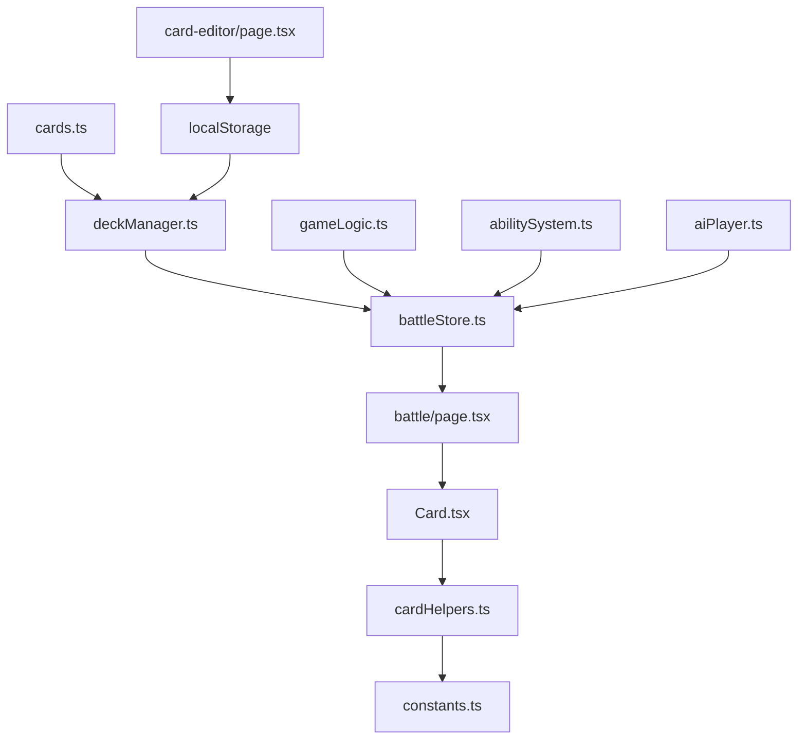

## Five Realms (Cúige na hÉireann)

A digital card battle game inspired by Irish mythology, built with Next.js and TypeScript.

## Game Overview

Five Realms is a Hearthstone-inspired card game featuring legendary figures and creatures from Irish folklore. Players battle using cards representing the five ancient provinces of Ireland, each with unique elemental affinities and mystical abilities.

## Quick Start

```bash
# Install dependencies
npm install

# Run development server
npm run dev

# Build for production
npm run build

# Start production server
npm start
```

Open [http://localhost:3000](http://localhost:3000) to play

## Project Structure

```
fiverealms/
├── app/                          # Next.js App Router
│   ├── battle/                   # Battle game page
│   ├── card-editor/              # Card creation interface
│   ├── layout.tsx                # Root layout with fonts
│   ├── page.tsx                  # Home page with navigation
│   └── globals.css               # Global styles & Tailwind
├── components/
│   └── game/
│       ├── Card.tsx              # Interactive card component
│       └── BattleCanvas.tsx      # Game board (future PIXI.js)
├── lib/
│   ├── game/                     # Core game logic modules
│   │   ├── gameLogic.ts          # Pure game mechanics & calculations
│   │   ├── deckManager.ts        # Deck creation & card management
│   │   ├── abilitySystem.ts      # Card abilities & effects processing
│   │   └── aiPlayer.ts           # AI decision making & behavior
│   ├── store/
│   │   └── battleStore.ts        # Simplified Zustand state management
│   ├── data/
│   │   └── cards.ts              # Expanded card database (28+ cards)
│   ├── types/
│   │   └── game.ts               # TypeScript interfaces
│   └── utils/
│       ├── cardHelpers.ts        # Card utility functions
│       ├── constants.ts          # Game constants & styling
├── public/
│   └── images/cards/             # Card artwork assets
└── package.json                  # Dependencies & scripts
```

## New Modular Architecture

### **Game Logic Separation (`lib/game/`)**
The game logic has been extracted from the monolithic `battleStore.ts` into focused modules:

#### **`gameLogic.ts`** - Pure Game Mechanics
```typescript
// Core game functions
createMinion(card: Card): Minion
enableMinionAttacks(minions: Minion[]): Minion[]
removeDead(minions: Minion[]): Minion[]
calculateCombatDamage(attacker: Minion, target: Minion): CombatResult
handleMinionCombat(attacker: Minion, target: Minion): CombatResult
handleHeroAttack(attacker: Minion, currentHealth: number): { damage: number; updatedAttacker: Minion }
updateBoardAfterCombat(board: Minion[], minionId: string, updatedMinion: Minion | null): Minion[]
incrementTurn(currentTurn: number, maxMana?: number): { turnNumber: number, newMaxMana: number }
checkGameOver(playerHealth: number, aiHealth: number): { gameOver: boolean, winner?: 'player' | 'ai' }
```

#### **`deckManager.ts`** - Deck & Card Management
```typescript
// Deck operations
createStartingDeck(): Card[]
drawCards(deck: Card[], count: number)
findPlayableCard(hand: Card[], availableMana: number)
removeCardFromHand(hand: Card[], cardIndex: number)
```

#### **`abilitySystem.ts`** - Card Abilities Processing
```typescript
// Ability processing
processAbilities(card: Card, trigger: 'battlecry' | 'deathrattle' | 'end_of_turn', state: BattleState, isPlayer: boolean)
processDeathrattles(minions: Minion[], state: BattleState, isPlayer: boolean)
processEndOfTurnEffects(minions: Minion[], state: BattleState, isPlayer: boolean)
```

#### **`aiPlayer.ts`** - AI Decision Making
```typescript
// AI behavior
getAIAction(aiState: Player, gameState: BattleState): AIAction
executeAIPlayCard(cardIndex: number, gameState: BattleState)
executeAIAttacks(gameState: BattleState)
evaluateBoardState(gameState: BattleState)
```

### **Simplified State Management**
The `battleStore.ts` is now focused purely on state management and UI concerns:
- **150 lines** (down from 300+)
- **Clean separation** between UI state and game logic
- **Better testability** through pure functions
- **Easier maintenance** with focused responsibilities

## File Interactions

### Core Game Flow
```
page.tsx → battle/page.tsx → battleStore.ts → game/ modules → game.ts
    ↓            ↓              ↓              ↓            ↓
navigation → game board → state mgmt → pure logic → type safety
```

### New Game Logic Flow
```
battleStore.ts
    ↓ delegates combat & state updates to
lib/game/
├── gameLogic.ts      # Combat resolution, board updates, game state
│   ├── Combat System        # handleMinionCombat, handleHeroAttack
│   ├── Board Management    # updateBoardAfterCombat, removeDead
│   └── State Management   # incrementTurn, checkGameOver
├── deckManager.ts    # Deck & hand management
├── abilitySystem.ts # Card ability processing
└── aiPlayer.ts      # AI decision making
```

### Card System
```
cards.ts → Card.tsx → cardHelpers.ts → constants.ts
    ↓         ↓           ↓              ↓
28+ cards → rendering → utilities → Celtic styling
```

## Key Files Explained

### **App Router (`app/`)**
- **`layout.tsx`**: Root layout with Geist fonts and metadata
- **`page.tsx`**: Landing page with game navigation
- **`battle/page.tsx`**: Main game interface with Celtic theming and SSR hydration fixes
- **`card-editor/page.tsx`**: Visual card creation tool
- **`globals.css`**: Tailwind imports and CSS variables

### ** Game Logic (`lib/game/`)**
- **`gameLogic.ts`**: Pure functions for combat, health, and game state calculations
- **`deckManager.ts`**: Deck creation, shuffling, and card drawing with SSR compatibility  
- **`abilitySystem.ts`**: Comprehensive ability processing system for all card effects
- **`aiPlayer.ts`**: Intelligent AI decision making with board evaluation and strategy

### **State Management (`lib/store/`)**
- **`battleStore.ts`**: Simplified Zustand store focused on UI state and async operations

### **Game Data (`lib/`)**
- **`types/game.ts`**: TypeScript definitions for cards, players, abilities
- **`data/cards.ts`**: Expanded card database with 28+ Irish mythology cards across all elements
- **`utils/cardHelpers.ts`**: Card utilities (ID generation, validation, filtering)
- **`utils/constants.ts`**: Game constants, Celtic styling themes, element colors

### **Components (`components/`)**
- **`game/Card.tsx`**: Interactive card with hover details and Celtic styling
- **`game/BattleCanvas.tsx`**: Placeholder for future PIXI.js game board

## Current Technology Stack

### **Frontend Framework**
- **Next.js 15.5.4** - React framework with App Router and SSR hydration fixes
- **React 19.1.0** - UI library with latest features
- **TypeScript 5** - Type safety and developer experience

### **Game Architecture**
- **Modular Design** - Separated concerns across focused modules
- **Pure Functions** - Testable game logic without side effects
- **State Management** - Clean separation between UI state and game logic

### **Styling & Animation**
- **Tailwind CSS 4** - Utility-first CSS framework
- **Framer Motion 12** - Animation library for card interactions
- **Custom CSS** - Celtic-themed gradients and mystical effects

### **State Management**
- **Zustand 5.0.8** - Lightweight state management (simplified)
- **React Hooks** - Local component state

### **Development Tools**
- **ESLint 9** - Code linting and formatting
- **PostCSS** - CSS processing
- **Turbopack** - Fast bundling (Next.js built-in)

## Data Flow



## Development Notes

### **Current Priorities**
1. Modular architecture refactoring
2. AI consistency improvements  
3. SSR hydration fixes
4. Expanded card collection
5. Enhanced ability system
6. PIXI.js integration planning

## Project Flow Explained

### **Entry Point Flow**
*When a user visits the app:*

1. **`layout.tsx`** sets up the root HTML structure with Geist fonts and metadata
2. **`page.tsx`** renders the home page with navigation buttons
3. User clicks "Start Battle" → routes to **`app/battle/page.tsx`**
4. Battle page initializes game state through **`battleStore.ts`**

### ** Game Initialization Flow**
*When starting a new battle:*

1. **`battleStore.ts`** calls **`createStartingDeck()`** from **`deckManager.ts`**
2. **`deckManager.ts`** imports cards from **`cards.ts`** and shuffles them (client-side only)
3. **`drawCards()`** deals initial hands to both players
4. **`createInitialState()`** sets up the battlefield with proper SSR compatibility

### **Game Action Flow**
*When players take actions:*

1. **Player attacks** → `battleStore.attack()`
   - Delegates to `handleMinionCombat` or `handleHeroAttack`
   - Updates board using `updateBoardAfterCombat`
   - Processes any deathrattles
2. **Combat Resolution**
   - Calculate damage using `calculateCombatDamage`
   - Update minion states
   - Remove dead minions using `removeDead`
   - Update combat log
3. **State Updates**
   - Board state changes
   - Health updates
   - Turn management

### ** AI Turn Flow**
*When AI takes their turn:*

1. **`aiPlayer.getAIAction()`** evaluates available cards and board state
2. **`executeAIPlayCard()`** plays the chosen card using **`gameLogic`** functions
3. **`executeAIAttacks()`** handles minion attacks with damage calculations
4. **Turn completion** always happens regardless of AI actions taken

### **Ability Processing Flow**
*When card abilities trigger:*

1. **`abilitySystem.processAbilities()`** filters abilities by trigger type
2. **Individual processors** handle damage, healing, card draw, etc.
3. **State updates** flow back through **`battleStore.ts`** to the UI
4. **Deathrattles** and **end-of-turn effects** process automatically

## Key Connection Points

### ** Modular Dependencies**
```typescript
// battleStore.ts imports:
import { createMinion, checkGameOver } from '../game/gameLogic'
import { createStartingDeck, drawCards } from '../game/deckManager'
import { processAbilities } from '../game/abilitySystem'
import { getAIAction, executeAIPlayCard } from '../game/aiPlayer'

// game modules import:
import { Card, BattleState } from '../types/game'
import { CARDS } from '../data/cards'
```

### **State Connections**
- `battleStore.ts` ↔ `battle/page.tsx` (Zustand hooks)
- `battle/page.tsx` → `Card.tsx` (props flow)
- `Card.tsx` → `battleStore.ts` (event handlers)
- `game/ modules` ← `battleStore.ts` (pure function calls)

### **Type Safety Flow**

1. **`lib/types/game.ts`** defines all interfaces
2. **`game/` modules** use these types for all function signatures
3. **`battleStore.ts`** maintains type safety when calling game functions
4. **Components** receive properly typed props for rendering

### Recent Improvements
- **Combat System Refactor** - Centralized combat logic in gameLogic.ts
- **Board State Management** - Improved minion death handling and combat resolution
- **Type Safety** - Better TypeScript interfaces for combat results
- **Code Organization** - Clearer separation between game logic and state management