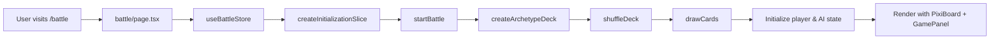
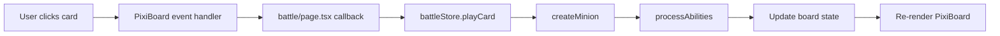
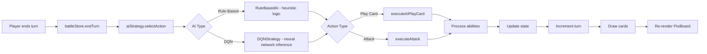
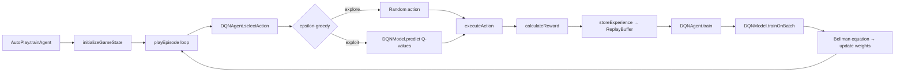
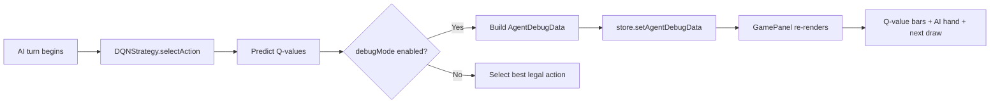

## Five Realms (Cúige na hÉireann)

Five Realms is a Hearthstone-inspired card game featuring figures and creatures from Irish folklore. Players battle using cards representing the five ancient provinces of Ireland, each with unique elemental aspects and abilities.

## Quick Start

```bash
# Install dependencies
npm install

# Run development server
npm run dev

# Run DQN training
npm run train

# Analyse latest training run
npm run analyse
```

## File Documentation
All files personally added to the project (not ones installed by the framework/libraries) have their own documentation commented in headers at the top of the corresponding file.

## Project Structure

```
fiverealms/
├── app/                          # Next.js App Router
│   ├── layout.tsx               # Root layout with fonts & metadata
│   ├── page.tsx                 # Home page with navigation
│   ├── battle/
│   │   └── page.tsx             # Battle page — deck selection + game board
│   ├── training/
│   │   └── page.tsx             # DQN training dashboard
│   └── api/
│       └── training-stats/
│           └── route.ts         # API route: reads agent state JSON for dashboard
│
├── components/
│   ├── game/
│   │   ├── PixiGameBoard.tsx    # PixiJS canvas wrapper component
│   │   └── GamePanel.tsx        # Tabbed React panel: Combat Log + Agent Debug overlay
│   ├── AISelector.tsx           # AI type selection UI (Rule-Based vs DQN)
│   └── DeckSelector.tsx         # Deck selection UI
│
├── lib/
│   ├── ai/                      # AI System
│   │   ├── aiStrategy.ts        # Strategy interface + RuleBasedAI + DQNStrategy
│   │   └── dqn/                 # Deep Q-Network Implementation
│   │       ├── ActionSpace.ts       # Action encoding/decoding (68 actions)
│   │       ├── AutoPlay.ts          # Self-play training loop
│   │       ├── DQNAgent.ts          # Agent brain (epsilon-greedy, replay buffer)
│   │       ├── DQNModel.ts          # TensorFlow.js neural network (Node.js, training)
│   │       ├── DQNModelBrowser.ts   # TensorFlow.js model loader (browser, inference)
│   │       ├── ExperienceReplay.ts  # Circular replay buffer (100k capacity)
│   │       ├── RewardSystem.ts      # Reward shaping & configs
│   │       └── stateEncoder.ts      # Game state -> 121-feature vector
│   │
│   ├── pixi/                    # PixiJS Rendering Engine
│   │   ├── PixiBoard.ts         # Main board orchestrator — diffs state before re-rendering
│   │   ├── index.ts             # Public exports
│   │   ├── layout/
│   │   │   └── BoardLayout.ts   # Position calculations for all game elements
│   │   ├── rendering/
│   │   │   ├── CardRenderer.ts      # Unified Hearthstone-style card creation
│   │   │   ├── HandRenderer.ts      # Player and AI hand rendering
│   │   │   ├── MinionRenderer.ts    # Board minion rendering
│   │   │   └── BoardRenderer.ts     # Static background rendering
│   │   ├── ui/
│   │   │   ├── UIManager.ts         # UI orchestration — updates elements in place
│   │   │   ├── HoverCardDisplay.ts  # Card hover tooltip (2x scaled card via CardRenderer)
│   │   │   ├── PortraitRenderer.ts  # Hero portraits with in-place health/mana updates
│   │   │   ├── EndTurnButton.ts     # Turn button with in-place enabled/disabled updates
│   │   │   ├── DeckIndicator.ts     # Deck counters using card back visual
│   │   │   └── TurnIndicator.ts     # Turn display with in-place updates
│   │   └── utils/
│   │       ├── TextureLoader.ts     # Singleton texture asset loader
│   │       ├── GraphicsHelpers.ts   # Reusable graphics primitives
│   │       ├── ScaleManager.ts      # Letterbox scaling for 1920x1080 design space
│   │       └── StyleConstants.ts    # Visual constants, colours, card dimensions
│   │
│   ├── game/                    # Pure Game Logic
│   │   ├── gameLogic.ts         # Core combat, minion, turn and fatigue logic
│   │   ├── deckManager.ts       # Deck building, card drawing, hand management
│   │   ├── abilitySystem.ts     # Card ability processing (battlecry, deathrattle)
│   │   └── aiPlayer.ts          # Rule-based AI decision-making and scoring
│   │
│   ├── store/
│   │   ├── battleStore.ts       # Main Zustand store — composes all slices
│   │   └── slices/
│   │       ├── battleSlice.ts        # Core battle state + debug mode + agent debug data
│   │       ├── deckSlice.ts          # Deck + AI type selection
│   │       ├── gameActionsSlice.ts   # Player action handlers (play card, attack, attack hero)
│   │       ├── turnSlice.ts          # Turn management + FSM-based AI turn execution
│   │       └── initializationSlice.ts # Battle initialization on Start Battle
│   │
│   ├── data/
│   │   ├── cards.ts             # Card database — all Fire, Earth and Neutral cards
│   │   └── decks.ts             # Structure deck definitions — 30-card curated decks
│   │
│   ├── types/
│   │   └── game.ts              # TypeScript interfaces (Card, Minion, Player, BattleState)
│   │
│   └── utils/
│       ├── cardHelpers.ts       # Card utility functions
│       └── constants.ts         # Game constants
│
├── models/                      # Training artefacts (gitignored)
│   ├── five-realms-dqn-agent-state.json   # Agent training state
│   └── five-realms-dqn-agent-replay.json  # Experience replay buffer
│
└── public/
    ├── models/
    │   └── five-realms-dqn-agent/
    │       └── weights.json     # Trained model weights (loaded by browser for inference)
    └── images/
        ├── cards/               # Card artwork (PNG)
        └── default/             # Placeholder images
```

## Architecture Overview

```
┌─────────────────────────────────────────────────────────────┐
│                    React UI Layer                           │
│  battle/page.tsx → PixiGameBoard.tsx + GamePanel.tsx        │
└────────────────────┬────────────────────────────────────────┘
                     │
                     ↓
┌─────────────────────────────────────────────────────────────┐
│              State Management Layer                         │
│       (battleStore.ts - Zustand with Slices)                │
└────────────────────┬────────────────────────────────────────┘
                     │
                     ↓
┌─────────────────────────────────────────────────────────────┐
│              Pure Game Logic Layer                          │
│  (gameLogic.ts, deckManager.ts, abilitySystem.ts)           │
└────────────────────┬────────────────────────────────────────┘
                     │
                     ↓
┌─────────────────────────────────────────────────────────────┐
│                   AI Layer                                  │
│  (aiStrategy.ts → RuleBasedAI | DQNStrategy → dqn/)        │
└────────────────────┬────────────────────────────────────────┘
                     │
                     ↓
┌─────────────────────────────────────────────────────────────┐
│              Data & Types Layer                             │
│              (cards.ts, decks.ts, game.ts)                  │
└─────────────────────────────────────────────────────────────┘
```

## Example Data Flow Diagrams

### **1. Game Initialization Flow**


```mermaid
graph LR
    A[User visits /battle] --> B[battle/page.tsx]
    B --> C[useBattleStore]
    C --> D[createInitializationSlice]
    D --> E[startBattle]
    E --> F[createArchetypeDeck]
    F --> G[shuffleDeck]
    G --> H[drawCards]
    H --> I[Initialize player & AI state]
    I --> J[Render with PixiBoard + GamePanel]
```

### **2. Player Action Flow**


```mermaid
graph LR
    A[User clicks card] --> B[PixiBoard event handler]
    B --> C[battle/page.tsx callback]
    C --> D[battleStore.playCard]
    D --> E[createMinion]
    E --> F[processAbilities]
    F --> G[Update board state]
    G --> H[Re-render PixiBoard]
```

### **3. AI Turn Flow**


```mermaid
graph LR
    A[Player ends turn] --> B[battleStore.endTurn]
    B --> C[aiStrategy.selectAction]
    C --> D{AI Type}
    D -->|Rule-Based| E[RuleBasedAI - heuristic logic]
    D -->|DQN| F[DQNStrategy - neural network inference]
    E --> G{Action Type}
    F --> G
    G -->|Play Card| H[executeAIPlayCard]
    G -->|Attack| I[executeAttack]
    H --> J[Process abilities]
    I --> J
    J --> K[Update state]
    K --> L[Increment turn]
    L --> M[Draw cards]
    M --> N[Re-render PixiBoard]
```

### **4. DQN Training Flow**


```mermaid
graph LR
    A[AutoPlay.trainAgent] --> B[initializeGameState]
    B --> C[playEpisode loop]
    C --> D[DQNAgent.selectAction]
    D --> E{epsilon-greedy}
    E -->|explore| F[Random action]
    E -->|exploit| G[DQNModel.predict Q-values]
    F --> H[executeAction]
    G --> H
    H --> I[calculateReward]
    I --> J[storeExperience → ReplayBuffer]
    J --> K[DQNAgent.train]
    K --> L[DQNModel.trainOnBatch]
    L --> M[Bellman equation → update weights]
    M --> C
```

### **5. Debug Overlay Flow**


```mermaid
graph LR
    A[AI turn begins] --> B[DQNStrategy.selectAction]
    B --> C[Predict Q-values]
    C --> D{debugMode enabled?}
    D -->|Yes| E[Build AgentDebugData]
    E --> F[store.setAgentDebugData]
    F --> G[GamePanel re-renders]
    G --> H[Q-value bars + AI hand + next draw]
    D -->|No| I[Select best legal action]
```

---

## AI System

The AI system uses the **Strategy Pattern** so opponent types can be swapped without changing game logic. Both implement the `AIStrategy` interface, making them interchangeable.

### Rule-Based AI (`aiStrategy.ts` → `aiPlayer.ts`)
A heuristic opponent that plays on curve, makes favourable board trades, and prioritises lethal damage. No training required.

### DQN Agent (`lib/ai/dqn/`)
A Deep Q-Network trained via self-play using TensorFlow.js. Training runs in Node.js; inference runs in the browser using the saved weights. Falls back to rule-based logic if no trained model is found.

| Component | File | Purpose |
|-----------|------|---------|
| Agent brain | `DQNAgent.ts` | Epsilon-greedy action selection, training loop |
| Training network | `DQNModel.ts` | 121->128->128->64->68 feed-forward network (Node.js) |
| Inference network | `DQNModelBrowser.ts` | Same architecture, weights loaded via fetch (browser) |
| Memory | `ExperienceReplay.ts` | Circular replay buffer (100k capacity) |
| Actions | `ActionSpace.ts` | Encodes/decodes 68 possible game actions |
| Rewards | `RewardSystem.ts` | Configurable reward shaping |
| State | `stateEncoder.ts` | Converts game state to 121-feature vector |
| Training loop | `AutoPlay.ts` | Self-play across all deck matchups |

**Action Space (68 total):**
- `0–9`: Play card from hand
- `10–59`: Attack with board minion (7 attackers × 7 targets)
- `60–66`: Attack enemy hero (7 attackers)
- `67`: End turn

**State Vector (121 features):** Player/opponent vitals (9), hand cards × 4 features (40), player board × 5 features (35), opponent board × 5 features (35), deck sizes (2) — all normalised to `[0, 1]`.

**Training configuration:**
- Discount factor: 0.95
- Learning rate: 0.00001
- Epsilon decay: 0.999993 (1.0 -> 0.01)
- Replay buffer: 100,000 experiences
- Target network sync: every 1,000 steps
- Training: 1,500 episodes per matchup × 4 matchups = 6,000 episodes per run

---

## Rendering Architecture

The rendering layer is split between PixiJS (canvas) and React (overlay):

**PixiJS (`lib/pixi/`)** handles all game board rendering — cards in hand, minions on board, hero portraits, deck indicators, end turn button, and the hover card tooltip. `PixiBoard.ts` diffs incoming state against the previous render and only rebuilds containers that have actually changed. All UI elements are created once and updated in place rather than being destroyed and recreated on every state change.

**React (`components/game/GamePanel.tsx`)** renders the left-side panel as an absolutely positioned overlay on the canvas. The panel uses a tab system to switch between the Combat Log (fed directly from Zustand) and the Agent Debug view (Q-value bars, AI hand mini cards, next draw). The debug tooltip is a React component rendered at `position: fixed` with high z-index, avoiding canvas z-order limitations.

**ScaleManager** letterboxes the 1920×1080 design space to fit any screen size. The React panel is positioned using percentage-based CSS to approximately match the Pixi coordinate space.

---

## Current Technology Stack

| Category          | Technology | Purpose |
|-------------------|------------|-------------------------------------|
| **Framework**     | Next.js    | React framework with App Router     |
| **UI Library**    | React      | Component-based UI                  |
| **Language**      | TypeScript | Type safety throughout              |
| **Rendering**     | PixiJS     | WebGL canvas rendering              |
| **State**         | Zustand    | Lightweight state management        |
| **Styling**       | Tailwind   | Utility CSS for React components    |
| **ML (training)** | TensorFlow.js (Node) | DQN training in Node.js  |
| **ML (inference)**| TensorFlow.js (browser) | Forward pass during gameplay |

---

## Deck System

Two playable structure decks are defined in `lib/data/decks.ts`, each 30 cards with a specific mana curve and strategy:

**Connacht Warriors (Fire)** — aggressive tempo deck. Fast minions, charge effects, burn spells, and direct face damage. Wins by maintaining pressure and closing out with high-attack finishers.

**Munster Endurance (Earth)** — defensive survival deck. Taunt walls, healing spells, and high-health minions. Wins by outlasting aggression and converting board advantage into late-game power.

Both decks include neutral cards (Brian Boru, Village Elder, Wandering Bard) that provide utility across archetypes.

Legendary cards are limited to 1 copy per deck; all other rarities allow 2 copies. A random deck mode is also available that pools all cards of the chosen element and selects 30 at random.