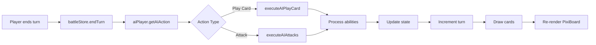

## Five Realms (Cúige na hÉireann)

Five Realms is a Hearthstone-inspired card game featuring figures and creatures from Irish folklore. Players battle using cards representing the five ancient provinces of Ireland, each with unique elemental aspects and abilities.

## Quick Start

```bash
# Install dependencies
npm install

# Run development server
npm run dev
```

## File Documentation
All files I've personally added to the project (not ones installed by the framework/libraries) will have their own documentation commented in headers at the top of 
the corresponding file. I am currently updating and adding to these where necessary.

## Project Structure

```
fiverealms/
├── app/                          # Next.js App Router
│   ├── layout.tsx               # Root layout with fonts & metadata
│   ├── page.tsx                 # Home page with navigation
│   └── battle/
│       └── page.tsx             # Battle page (React wrapper)
│
├── components/
│   ├── game/
│   │   ├── PixiGameBoard.tsx    # PixiJS canvas wrapper component
│   │   └── Card.tsx             # Card component (legacy)
│   └── DeckSelector.tsx         # Deck selection UI
│
├── lib/
│   ├── pixi/                    # PixiJS Rendering Engine
│   │   ├── PixiBoard.ts         # Main board orchestrator
│   │   ├── index.ts             # Public exports
│   │   ├── layout/
│   │   │   └── BoardLayout.ts   # Hearthstone-style positioning
│   │   ├── rendering/
│   │   │   ├── CardRenderer.ts      # Card visual creation
│   │   │   ├── HandRenderer.ts      # Hand rendering
│   │   │   ├── MinionRenderer.ts    # Board minion rendering
│   │   │   └── BoardRenderer.ts     # Background rendering
│   │   ├── ui/
│   │   │   ├── UIManager.ts         # UI orchestration
│   │   │   ├── PortraitRenderer.ts  # Hero portraits
│   │   │   ├── CombatLogRenderer.ts # Combat log
│   │   │   ├── EndTurnButton.ts     # Turn button
│   │   │   ├── DeckIndicator.ts     # Deck counters
│   │   │   └── TurnIndicator.ts     # Turn display
│   │   └── utils/
│   │       ├── TextureLoader.ts     # Asset loading
│   │       ├── GraphicsHelpers.ts   # Reusable graphics components
│   │       └── StyleConstants.ts    # Visual constants & colors
│   │
│   ├── game/                    # Pure Game Logic
│   │   ├── gameLogic.ts         # Core combat & minion logic
│   │   ├── deckManager.ts       # Deck building & card drawing
│   │   ├── abilitySystem.ts     # Card ability processing
│   │   └── aiPlayer.ts          # AI decision-making
│   │
│   ├── store/
│   │   ├── battleStore.ts       # Main Zustand store
│   │   └── slices/              # Modular state slices
│   │       ├── battleSlice.ts        # Core battle state
│   │       ├── deckSlice.ts          # Deck selection
│   │       ├── gameActionsSlice.ts   # Play/attack actions
│   │       ├── turnSlice.ts          # Turn management & AI
│   │       └── initializationSlice.ts # Game initialization
│   │
│   ├── data/
│   │   └── cards.ts             # Temporary card database
│   │
│   ├── types/
│   │   └── game.ts              # TypeScript interfaces
│   │
│   └── utils/
│       ├── cardHelpers.ts       # Card utility functions
│       └── constants.ts         # Game constants & styling
│
└── public/images/               # Game Assets
    ├── cards/                   # Card artwork (PNG)
    └── default/                 # Placeholder images
```

## Architecture Overview

```
┌─────────────────────────────────────────────────────────────┐
│                    React UI Layer                           │
│  (battle/page.tsx → PixiGameBoard.tsx → PixiBoard.ts)       │
└────────────────────┬────────────────────────────────────────┘
                     │
                     ↓
┌─────────────────────────────────────────────────────────────┐
│              State Management Layer                         │
│       (battleStore.ts - Zustand with Slices)                │
└────────────────────┬────────────────────────────────────────┘
                     │
                     ↓
┌─────────────────────────────────────────────────────────────┐
│              Pure Game Logic Layer                          │
│  (gameLogic.ts, deckManager.ts, abilitySystem.ts, etc.)     │
└────────────────────┬────────────────────────────────────────┘
                     │
                     ↓
┌─────────────────────────────────────────────────────────────┐
│              Data & Types Layer                             │
│              (cards.ts, game.ts)                            │
└─────────────────────────────────────────────────────────────┘
```

## Example Data Flow Diagrams

### **1. Game Initialization Flow**


### **2. Player Action Flow**


### **3. AI Turn Flow**



---

## Current Technology Stack

| Category          | Technology | Purpose |
|-------------------|------------|-------------------------------------|
| **Framework**     | Next.js    | React framework with App Router     |
| **UI Library**    | React      | Component-based UI                  |
| **Language**      | TypeScript | Type safety                         |
| **Rendering**     | PixiJS     | WebGL canvas rendering              |
| **State**         | Zustand    | Lightweight state management        |
| **Stylings**      | Tailwind   | Inlining CSS styles for ease of use |

---

## Immediate Todo (This Week)
- [ ] Refactor multiple files and remove unused/legacy code and functions
- [ ] Researching AI Training model and how this might be implemented using my states and/or Battlestore

## Medium-term Todo (End of November and all of December)
- [ ] Implement sprite pooling to better improve PixiJS performance
- [ ] Fully implement AI machine learning in some shape or form

## Long-term Todo (Next Semester)
- [ ] Set up database for cards, accounts + logins for multiple players
- [ ] Add WebSocket support for multiplayer
- [ ] Implement deck builder UI, glossary for all cards and lore information

---
